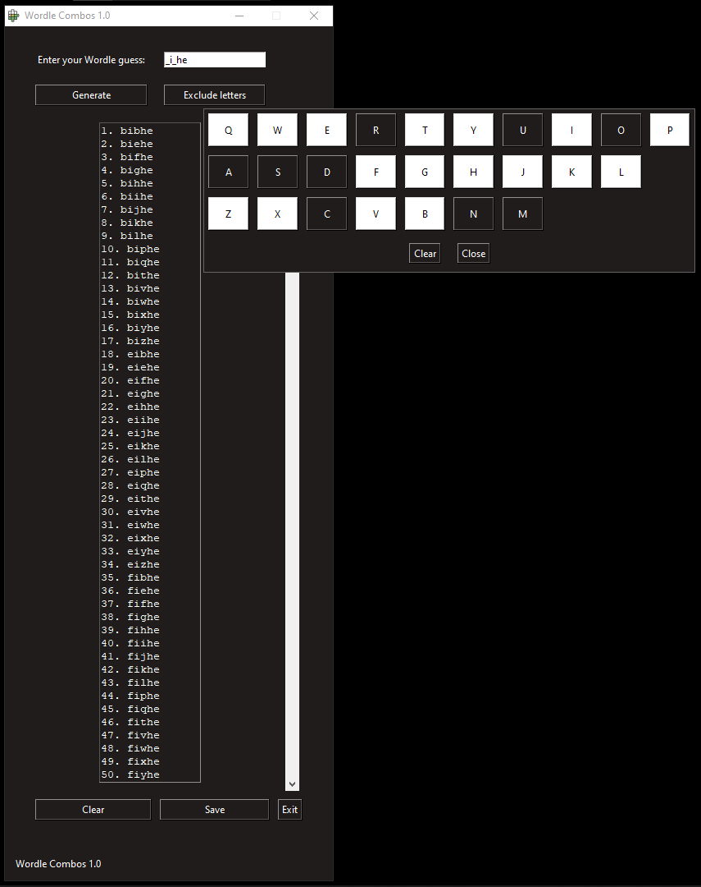

# Ab's Wordle Combos #
Tkinter GUI to generate all the possible letter combinations for an incomplete Wordle guess.

  

# Features #  
- Generates all possible letter combinations for a five character word.
- Specific letters can be excluded from the pool in case they've already been defined as not-in-the-word by Wordle.
- Numbered outputs.
- Output can be selected, copied and pasted elsewhere.
- Output can be saved locally as a .txt file.
- Easily repeatable process.
  
# Requirements #  
For running the .py file:
- Python 3.x
- OS module.
- Pillow module.
- Tkinter module.
  
Else you can run the .exe file on windows 10 or above.

# How to use #
For running the .py file:  
1. Ensure Python 3.x and the required libraries are installed.
2. Place the settings_icon.png & Wordle_Combos_Logo.ico in the same directory as the .py file.
3. Run Wordle_Combos_1.0.py

Else run the .exe file, eitherway:
1. Enter five characters, use underscores '_' to be replaced for letters.
2. Optionally, click 'Exclude letters' and select those to not be used.
3. Click 'Generate'.
4. Optionally, click 'Save' to export the output as a .txt file to your computer.

# Notes #
- Inputs that aren't 5 characters aren't processed.
- Compute time depends on your system's specs.
- Excluded letters settings are saved even after closing the program, make sure to clear exclude letters between different inputs.

# How it works #
- Global: the libraries used are imported, and functions for each action are defined.
- Main: the GUI is defined, each function is triggered with a button.

# Contributors #
- Abdiel Alfonso Rincon Cantu

# License #
MIT License

Copyright (c) 2024 Abdiel Alfonso Rincon Cantu

Permission is hereby granted, free of charge, to any person obtaining a copy of this software and associated documentation files (the "Software"), to deal in the Software without restriction, including without limitation the rights to use, copy, modify, merge, publish, distribute, sublicense, and/or sell copies of the Software, and to permit persons to whom the Software is furnished to do so, subject to the following conditions:

The above copyright notice and this permission notice shall be included in all copies or substantial portions of the Software.

THE SOFTWARE IS PROVIDED "AS IS", WITHOUT WARRANTY OF ANY KIND, EXPRESS OR IMPLIED, INCLUDING BUT NOT LIMITED TO THE WARRANTIES OF MERCHANTABILITY, FITNESS FOR A PARTICULAR PURPOSE AND NONINFRINGEMENT. IN NO EVENT SHALL THE AUTHORS OR COPYRIGHT HOLDERS BE LIABLE FOR ANY CLAIM, DAMAGES OR OTHER LIABILITY, WHETHER IN AN ACTION OF CONTRACT, TORT OR OTHERWISE, ARISING FROM, OUT OF OR IN CONNECTION WITH THE SOFTWARE OR THE USE OR OTHER DEALINGS IN THE SOFTWARE.

